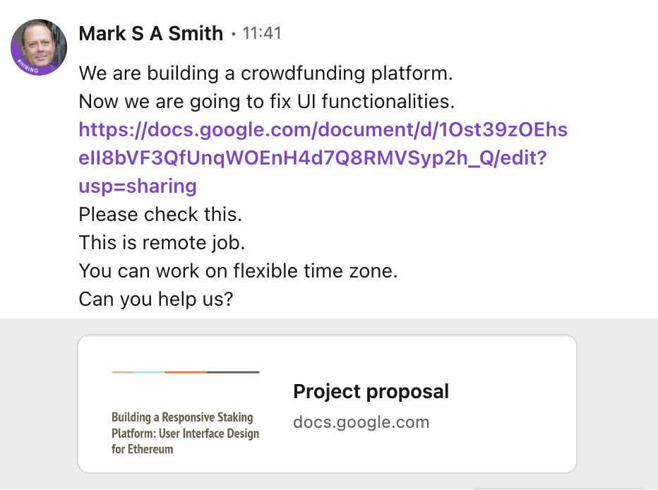
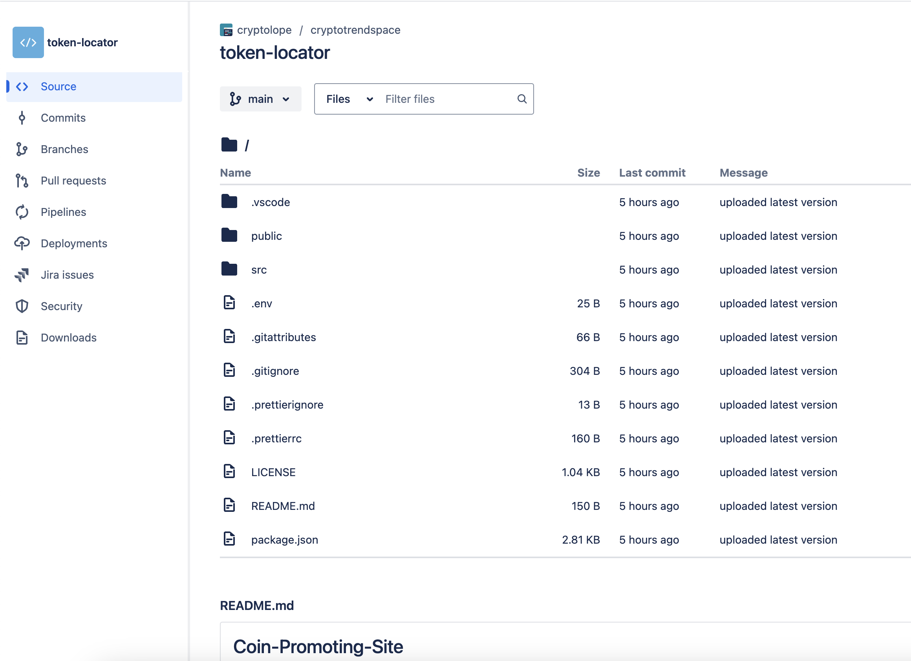

# repo-scam
List of repos where scammers try to make you run a project with hidden purposes

The modus operandi is like they make contact of people from linkedin, the profiles look professional and old, my best guess is that they got hacked and didt care or is just linkedin poor security management.

Some examples

This second one more doubtful than the first one

They share a message offering or needing a developer

The repo link was this one https://bitbucket.org/1omicrowdfunding/lomicrowdfunding/src is removed now. It was a node project.
The smart contract address was this one https://etherscan.io/address/0x3fecf54ca140e583333b01f34eba142205d0e9cf.

The second chat repo was this one https://bitbucket.org/cryptolope/token-locator/src/main/, where the repo was created 4 hours before the contact, very suspicios, especially since the first message said the had more than 20 professionals, but only one commit by one person.

I guess the lesson is not to trust anyone, if it is too good to be true, it is.   